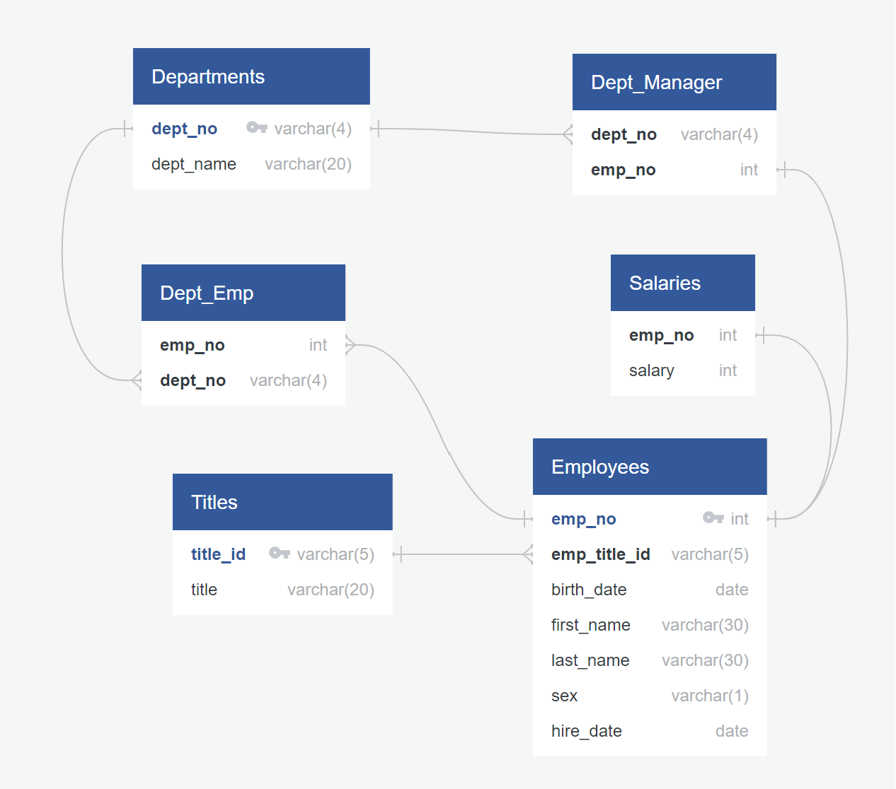

# sql-challenge

## Background

* Create an entity relationship diagram (ERD) using [QuickDBD](https://app.quickdatabasediagrams.com/#/d/EzvXN6) based on csv files that make up the employee database of people whom the company employed during the 1980s and 1990s  

* Create a table schema: `EmployeeSQL/schemata_employees.sql`
* Analyse employee data, e.g., name, sex, salary, department: `EmployeeSQL/employees_analysis.sql`

## Data source

Data generated by Mockaroo, LLCLinks to an external site., (2022). Realistic Data Generator.

## References

[Set database - how to read date format](https://dba.stackexchange.com/questions/19679/how-to-set-postgresql-database-to-see-date-as-mdy-permanently)